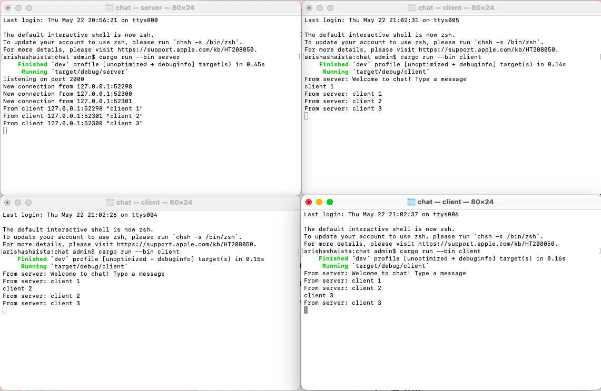
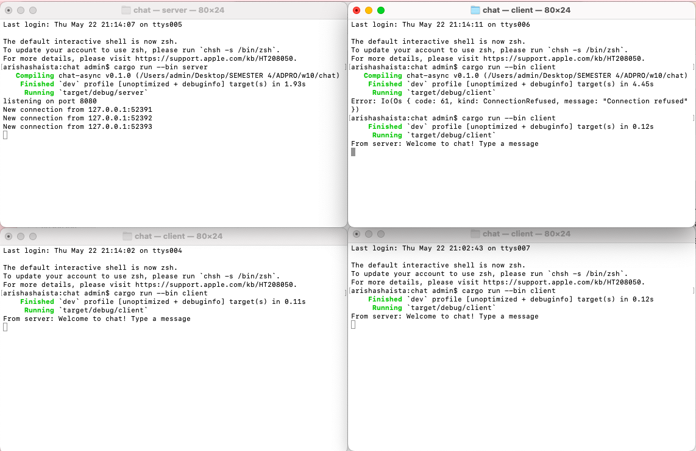

1. **Try to run one server, and three clients.**

Dari gambar, setiap kali satu klien mengirim pesan, server akan menangkapnya lalu melakukan broadcast ke semua klien yang terhubung, termasuk pengirimnya sendiri. Server bisa melakukan ini karena ia menyimpan daftar koneksi aktif dan terus memantau kedatangan pesan. Begitu pesan masuk, server langsung meneruskannya ke setiap koneksi dalam daftar.

2. **Try to modify the port to be 8080. Test it again.**

Untuk berjalan dengan baik, perlu mengubah kedua port pada client dan server menjadi 8080. Jika keduanya memiliki port yang berbeda, client tidak akan dapat terhubung ke server.

